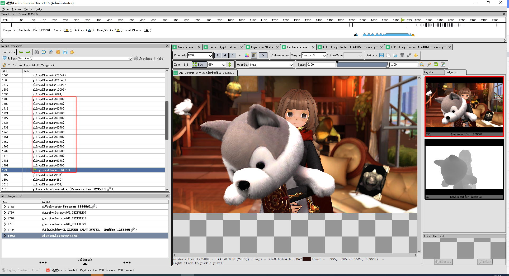
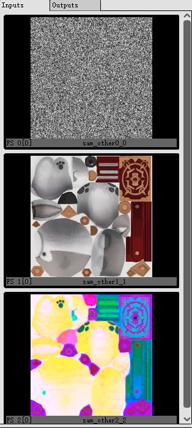
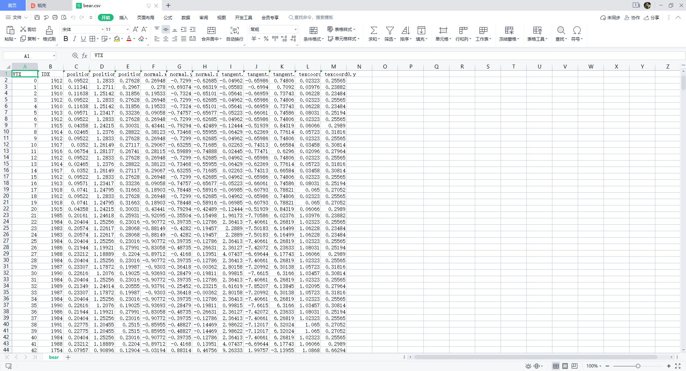
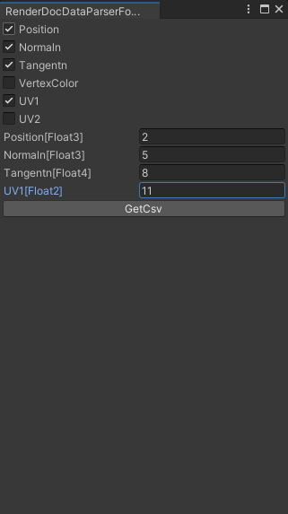
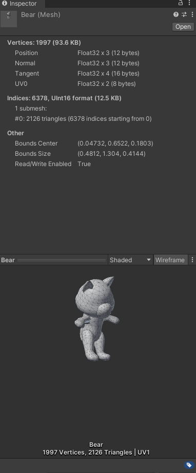
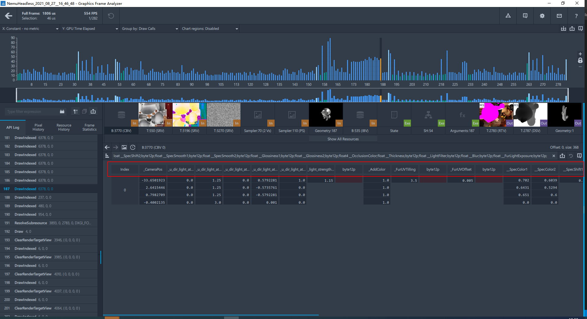
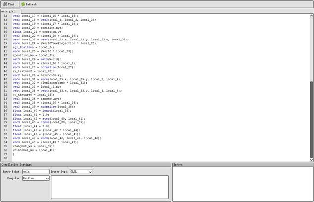
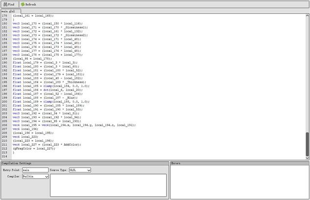
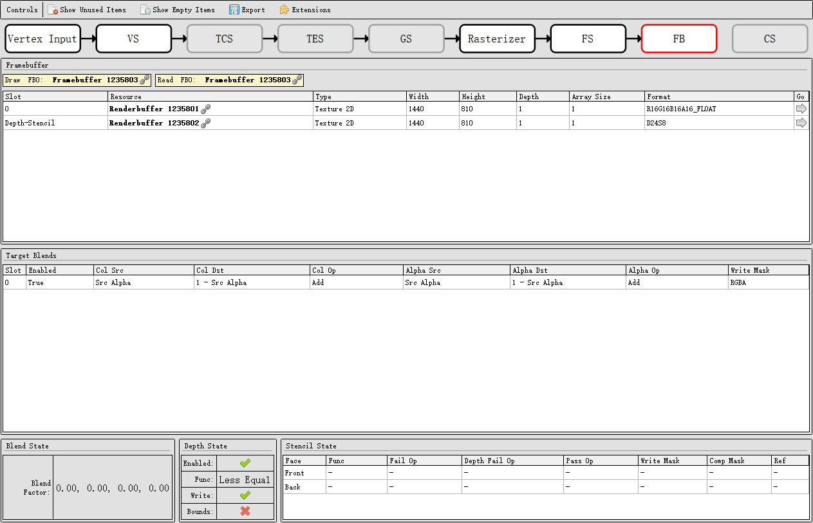
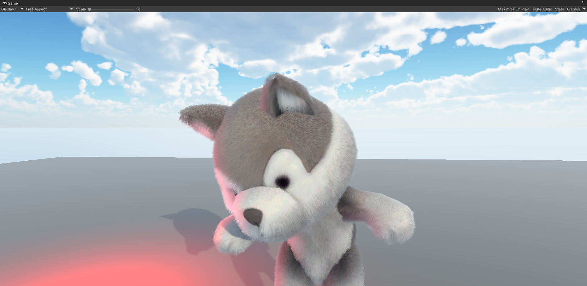

# Character
 Character Renderer

项目介绍(角色相关,目前只有毛发效果)
-----------------------------------------------------------------------------------------------------------------------
《幻术启示录》截帧数据,使用了16个PASS

《幻术启示录》输入图的数据

《幻术启示录》模型数据数据

《幻术启示录》根据模型数据还原到unity

《幻术启示录》使用GM截到的数据

《幻术启示录》VS、FS、FB代码和数据

根据上面所述的所有数据最终可以在unity里面完整逆向还原

PBR版本的效果

